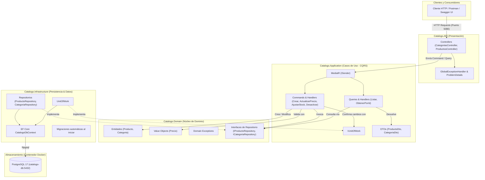

# Catálogo Service

Microservicio para la gestión de productos y categorías del e-commerce de electrónicos, implementado en **.NET 10** y **PostgreSQL**. Aplica **Clean Architecture** y **Domain-Driven Design (DDD)**, con los patrones **CQRS**, **Mediator**, **Repository** y **Unit of Work**.

## Integrantes

- Simón Vanegas
- Efrén Cuadrado
- Sofía Castrillón
- Franyelica García
- Santiago Castaño

---

## Requisitos

- [Docker](https://www.docker.com/) y [Docker Compose](https://docs.docker.com/compose/)
- *(Opcional)* [.NET 10 SDK](https://dotnet.microsoft.com/) para desarrollo local sin contenedores.

---

## Gestión de Contenedores (Docker Compose)

El entorno incluye dos servicios definidos en [`docker-compose.yml`](docker-compose.yml):

- **`catalogo-api`**: API REST en .NET expuesta en el puerto `5080`.
- **`catalogo-db`**: Base de datos PostgreSQL 17 expuesta en el puerto `5433`.

La API espera a que la base de datos esté lista (`healthcheck`) y aplica las migraciones automáticamente al iniciar.

### Inicio rápido

```bash
docker compose up -d --build
```

Swagger queda disponible en http://localhost:5080/swagger.

### Comandos más utilizados

#### Iniciar y detener
```bash
# Iniciar servicios en segundo plano
docker compose up -d

# Reconstruir imágenes y levantar (usar tras modificar código C#)
docker compose up -d --build

# Detener los contenedores sin borrarlos
docker compose stop

# Reanudar contenedores detenidos
docker compose start

# Reiniciar servicios (o uno en específico: docker compose restart catalogo-api)
docker compose restart

# Detener y remover contenedores y red
docker compose down

# Detener, remover contenedores y eliminar el volumen de datos de PostgreSQL
docker compose down -v
```

#### Monitoreo y logs
```bash
# Ver estado y mapeo de puertos de los contenedores
docker compose ps

# Ver logs en tiempo real de todos los servicios
docker compose logs -f

# Ver logs de un servicio específico
docker compose logs -f catalogo-api
docker compose logs -f catalogo-db
```

#### Acceso directo a contenedores
```bash
# Acceder a la consola interactiva psql de PostgreSQL
docker compose exec catalogo-db psql -U catalogo -d catalogo

# Abrir una terminal interactiva dentro del contenedor de la API
docker compose exec catalogo-api sh
```

### Ejecución local sin Docker para la API

```bash
docker compose up -d catalogo-db
dotnet run --project src/Catalogo.API
```

La API usa la cadena de conexión de `appsettings.json` (`localhost:5433`).

Para crear una nueva migración después de cambiar el modelo:

```bash
dotnet ef migrations add NombreMigracion \
  --project src/Catalogo.Infrastructure \
  --startup-project src/Catalogo.API \
  --output-dir Persistence/Migrations
```

---

## Documentación de Endpoints

- **URL Base:** `http://localhost:5080`
- **Swagger UI:** `http://localhost:5080/swagger` (disponible en entorno `Development`)

---

### Categorías (`/api/categorias`)

| Método | Ruta | Descripción | Respuestas |
| :--- | :--- | :--- | :--- |
| `POST` | `/api/categorias` | Crea una nueva categoría | `201 Created`, `400 Bad Request` |
| `GET` | `/api/categorias` | Lista todas las categorías | `200 OK` |
| `GET` | `/api/categorias/{id}` | Obtiene una categoría por su ID (`Guid`) | `200 OK`, `404 Not Found` |

#### Payload: Crear categoría (`POST /api/categorias`)
```json
{
  "nombre": "Electrónica"
}
```

---

### Productos (`/api/productos`)

| Método | Ruta | Descripción | Respuestas |
| :--- | :--- | :--- | :--- |
| `POST` | `/api/productos` | Crea un nuevo producto | `201 Created`, `400 Bad Request` |
| `GET` | `/api/productos` | Lista productos (filtro opcional: `?categoriaId={guid}`) | `200 OK` |
| `GET` | `/api/productos/{id}` | Obtiene un producto por su ID (`Guid`) | `200 OK`, `404 Not Found` |
| `PATCH` | `/api/productos/{id}/precio` | Actualiza el precio y moneda | `204 No Content`, `400`, `404` |
| `PATCH` | `/api/productos/{id}/stock` | Ajusta el inventario (suma o resta) | `204 No Content`, `400`, `404` |
| `PATCH` | `/api/productos/{id}/desactivar` | Marca el producto como inactivo | `204 No Content`, `400`, `404` |

#### Payload: Crear producto (`POST /api/productos`)
```json
{
  "nombre": "Teclado Mecánico",
  "descripcion": "Teclado inalámbrico RGB",
  "precio": 89.99,
  "moneda": "USD",
  "stock": 25,
  "categoriaId": "3fa85f64-5717-4562-b3fc-2c963f66afa6"
}
```

#### Payload: Actualizar precio (`PATCH /api/productos/{id}/precio`)
```json
{
  "valor": 79.99,
  "moneda": "USD"
}
```

#### Payload: Ajustar stock (`PATCH /api/productos/{id}/stock`)
```json
{
  "cantidad": 10
}
```
> **Nota:** Para restar inventario se envían valores negativos (ej. `"cantidad": -5`).

---

### Colección de Postman

El archivo [`docs/Catalogo.postman_collection.json`](docs/Catalogo.postman_collection.json) tiene 22 peticiones: 9 del flujo exitoso y 13 de errores de validación de dominio. Para ejecutarla:

1. Partir de una base limpia: `docker compose down -v && docker compose up -d --build`.
2. En Postman: **Import** → seleccionar el archivo → **Run collection**.

### Formato de errores

Los errores se devuelven en formato **ProblemDetails** (RFC 9457). Ejemplo al crear una categoría duplicada:

```json
{
  "type": "https://tools.ietf.org/html/rfc9110#section-15.5.1",
  "title": "Regla de negocio violada",
  "status": 400,
  "detail": "Ya existe una categoría con el nombre 'Prueba'."
}
```

| Código | Cuándo ocurre |
| :--- | :--- |
| `400` | Se viola una regla de negocio del dominio |
| `404` | El recurso solicitado no existe |
| `500` | Error inesperado (sin exponer detalles internos) |

---

## Arquitectura del Sistema

El proyecto implementa **Clean Architecture**: las dependencias apuntan hacia el dominio, que no depende de ninguna otra capa. La capa de aplicación usa **CQRS** con **MediatR**, manteniendo el núcleo de negocio desacoplado de la infraestructura y la presentación.



### Patrones aplicados

- **DDD:** `Producto` es la raíz de agregado y protege sus reglas (precio mayor a cero, stock no negativo, no modificar productos desactivados). `Precio` es un value object inmutable. `Producto` referencia a `Categoria` solo por su Id.
- **CQRS:** las operaciones que escriben (Commands) están separadas de las que leen (Queries).
- **Mediator:** los controllers solo envían Commands y Queries con `ISender` de MediatR; no conocen a los handlers.
- **Repository:** las interfaces están en el dominio y las implementaciones en infraestructura.
- **Unit of Work:** los repositorios solo agregan o modifican; `IUnitOfWork.SaveChangesAsync` confirma todo en una sola transacción.

---

## Estructura del Proyecto

```text
├── Catalogo.slnx
├── Dockerfile
├── docker-compose.yml
├── docs/
│   └── Catalogo.postman_collection.json
└── src/
    ├── Catalogo.Domain/          # Entidades, Value Objects, excepciones y reglas de negocio
    ├── Catalogo.Application/     # Casos de uso (Commands/Queries con MediatR) y DTOs
    ├── Catalogo.Infrastructure/  # Persistencia con EF Core, repositorios, Unit of Work y migraciones
    └── Catalogo.API/             # Controladores REST, manejo de errores y configuración de inicio
```

---

## Flujo de trabajo (Git Flow)

| Rama | Propósito |
| :--- | :--- |
| `main` | Versiones entregadas (tag `v1.0.0`) |
| `develop` | Integración del trabajo del equipo |
| `feature/*` | Una funcionalidad por rama, integrada mediante Pull Request revisado |
| `release/*` | Preparación de cada entrega |
| `hotfix/*` | Correcciones urgentes sobre `main` |

Las ramas `main` y `develop` están protegidas: solo reciben cambios por Pull Request con al menos una aprobación.
